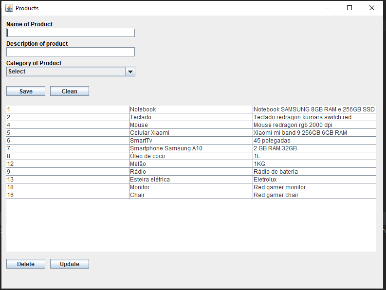

##View

## Techs:
 - PostgreSQL, with any framework ORM :D .
 - Java Swing

## About this course:
- In this course I learned about how to connect using native java interfaces to another driver of some database. Some design patterns such as "Factory" and "DAO" were presented. I tried to apply everything I did without the help of any framework.

## Contribuing
- All the project code is open, that is, dear friend, you can download, change, create new tools for this little project.